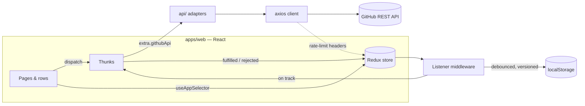

# Repo Radar

Search GitHub repositories, track the ones that matter, and watch their stars,
open issues and latest commits — in a dashboard that feels at home next to
GitHub, with its own night-sky identity in light and dark.

**Stack:** React 19 · TypeScript 6 (strict) · Redux Toolkit · MUI 9 · MUI X
Charts · React Router · Vite 8 · Vitest · GitHub REST API · Vercel

## What it does

| Requirement                                   | Where it lives                                                                        |
| --------------------------------------------- | ------------------------------------------------------------------------------------- |
| Debounced repository search                   | `useRepoSearch` — 400 ms debounce, 2+ characters, superseded requests aborted         |
| Track / untrack repositories                  | `TrackButton` (a real toggle: `aria-pressed`), untrack with **Undo** on the dashboard |
| Tracked repos view                            | `/tracked` — lazy-loaded route, the chart library only loads here                     |
| Stars, open issues, last commit date          | One snapshot per repo: repository + latest commit on its **default branch**           |
| Refresh one repo and/or all repos             | Per-row refresh, **Refresh all**, and stale-only refresh when the dashboard opens     |
| Independent loading and error states per repo | `requests[repoId]` in the store; each row selects only its own entity and request     |
| Persist tracked repos in localStorage         | Versioned, validated snapshot written by listener middleware (debounced)              |
| Proper TypeScript types                       | GitHub's own OpenAPI types at the edge, mapped once into small domain models          |
| Bar chart of stars per tracked repo           | `@repo-radar/charts` `BarChart` — sorted, themed, with an accessible data table       |

Also: light / dark / system themes with no flash on load, a live GitHub
rate-limit indicator, a `/` shortcut to search, and a monorepo with a UI
package and a plots package.

## Getting started

```bash
npm install
npm run dev          # http://localhost:5173
```

Node 22.13+ (see `.nvmrc`). Anonymous GitHub access allows 60 requests an hour
and 10 searches a minute. To lift that while developing, put a token in
`apps/web/.env.local` — the Vite proxy attaches it server-side, so it never
reaches the browser bundle:

```bash
GITHUB_TOKEN=github_pat_...   # a fine-grained token with no permissions is enough
```

| Script              | What it runs                                      |
| ------------------- | ------------------------------------------------- |
| `npm run dev`       | The app with hot reload                           |
| `npm run build`     | Type-check, then a production build of `apps/web` |
| `npm test`          | Every workspace's tests (Vitest projects)         |
| `npm run lint`      | ESLint (type-aware, strict) across the repo       |
| `npm run typecheck` | `tsc` in every workspace                          |
| `npm run storybook` | The design system at http://localhost:6006        |
| `npm run check`     | Everything CI runs, in CI's order                 |

## Repository layout

```
repo-radar/
├── apps/
│   └── web/                      # the Repo Radar app
│       └── src/
│           ├── api/              # the one HTTP edge: axios client, adapters, DTO → model mappers, error normalizer
│           ├── store/            # slices + thunks + selectors, listener middleware, setupStore()
│           ├── domain/           # pure logic with no React or Redux (persisted-state validation)
│           ├── hooks/            # typed Redux hooks, useDebouncedValue
│           ├── components/       # app components shared by pages (RepoIdentity, TrackButton, …)
│           ├── pages/            # route screens, each with its own components/ and hooks/
│           ├── layouts/          # the frame every page renders in
│           ├── constants/ types/ utils/ config/
│           └── __tests__/        # integration tests + shared test support
├── packages/
│   ├── ui/                       # design system: tokens → MUI theme, colour modes, components
│   │   └── .storybook/           # one Storybook for both packages, in the real theme provider
│   └── charts/                   # plots: themed, accessible charts on MUI X Charts
├── docs/adr/                     # architecture decision records
└── .github/workflows/ci.yml
```

Packages are consumed **from source** (`exports` → `src/index.ts`): no build
step, one version of everything, and a design-system change ships in the same
commit as the app change that needs it ([ADR 0001](docs/adr/0001-one-workspace-with-source-consumed-packages.md)).

## Architecture



**State and data layer.** Two slices do the work. `search` holds the
ephemeral results of the latest query. `trackedRepos` is an entity adapter
of the user's watchlist — each repo carries its last-known stats — plus a
`requests` map with the loading/error state of every repo. The thunks reach
GitHub through an API object injected as the thunk `extraArgument`, which is
the seam every thunk test uses. Why slices and thunks rather than RTK Query:
[ADR 0002](docs/adr/0002-thunks-and-slices-own-the-data-layer.md).

**Asynchronous work, handled on purpose.**

- **Debounce + cancel-on-change.** Search waits for a 400 ms pause, then aborts
  the request it replaces (the thunk's `AbortSignal` goes all the way to axios).
- **Latest wins.** A response only lands if its `requestId` is still the
  current one, so a slow, stale answer can never overwrite a newer one.
- **Per-repo independence.** `refreshRepo(id)` writes only `requests[id]`;
  "Refresh all" dispatches one thunk per repo and awaits them together — every
  thunk settles on its own action, so one failure never blocks the rest.
- **No duplicate requests.** A thunk `condition` skips a repo that is already
  refreshing, so double clicks and overlapping "Refresh all" cost one request.
- **Cheap to open.** The dashboard refreshes only repos older than ten minutes.
- **Side effects in one place.** Fetching a newly tracked repo and persisting
  the watchlist are listener middleware — never reducers, never components.

**Errors.** `normalizeApiError` is the only place a thrown request becomes UI
state: a serializable `{ kind, message, status, resetAt }`. The UI reads the
kind: a spent rate limit says when it resets, a missing repo offers no pointless
retry, and a failed row keeps showing its last-known stats.

**Design system.** `@repo-radar/ui` turns one set of tokens (raw ramps → semantic
roles per scheme) into a CSS-variables MUI theme with light, dark and system
modes, plus the components the app is built from. The app never imports MUI
directly — ESLint enforces it ([ADR 0003](docs/adr/0003-the-design-system-is-the-only-door-to-mui.md)).
A contrast test checks every text role against its surfaces (WCAG AA) in both
schemes.

**Persistence.** The watchlist is stored as `{ version, repos }`. On load every
entry is validated on its own, so corrupt or foreign data costs one repo, not
the list ([ADR 0004](docs/adr/0004-tracked-repos-persist-as-a-versioned-snapshot.md)).

## Testing

Tests cover the three tiers the code has:

- **Units** — reducers driven by the thunks' own action creators, selectors,
  the error normalizer, API adapters against a mocked axios client, storage
  validation, formatting, and a token-contrast contract for the theme.
- **Store** — thunks against a real store with a scripted GitHub API: refresh-all
  with one failure, de-duplicated refreshes, stale-only refresh, debounced
  persistence.
- **Integration** — the real app (store, theme, router) with a scripted GitHub:
  search → track → dashboard, cancel-on-change, rate-limit errors, per-row
  failures, undo.

Tests query by role and accessible name, never by class names.

## Storybook

`packages/ui` hosts one Storybook for both source-consumed packages, so the
charts are themed by the same provider the components are:

```bash
npm run storybook
```

Every story runs inside the real `ThemeProvider`, and the toolbar's theme
control drives the same hook the app's own colour-mode menu does — so light,
dark and system are exercised against the actual tokens rather than a copy.
`Foundations/Colours` renders the semantic roles straight from
`theme.vars.palette`, which makes a missing or drifted role visible at a glance.
The a11y addon runs axe on every story.

## Deploying (Vercel)

Two projects from the same repository:

| Project   | Root Directory | Config                    | Output                         |
| --------- | -------------- | ------------------------- | ------------------------------ |
| The app   | repo root      | `vercel.json`             | `apps/web/dist`                |
| Storybook | `packages/ui`  | `packages/ui/vercel.json` | `packages/ui/storybook-static` |

Both install and build from the **workspace root**: `typescript` and `vite` are
declared once there, so an install scoped to a single workspace leaves `tsc`
missing and the build exits 127.

Neither project takes an environment variable. `VITE_GITHUB_API_URL` stays unset
in production so the app calls `api.github.com` directly, and `GITHUB_TOKEN` is
deliberately un-prefixed — it only ever decorates the dev server's proxy and
never reaches a bundle.

## What I'd do next

- A Vercel function proxy with a server-side token, lifting the shared anonymous
  rate limit for every visitor.
- Star history: keep previous snapshots to show trends, not just totals.
- Playwright end-to-end tests against a mocked GitHub.
